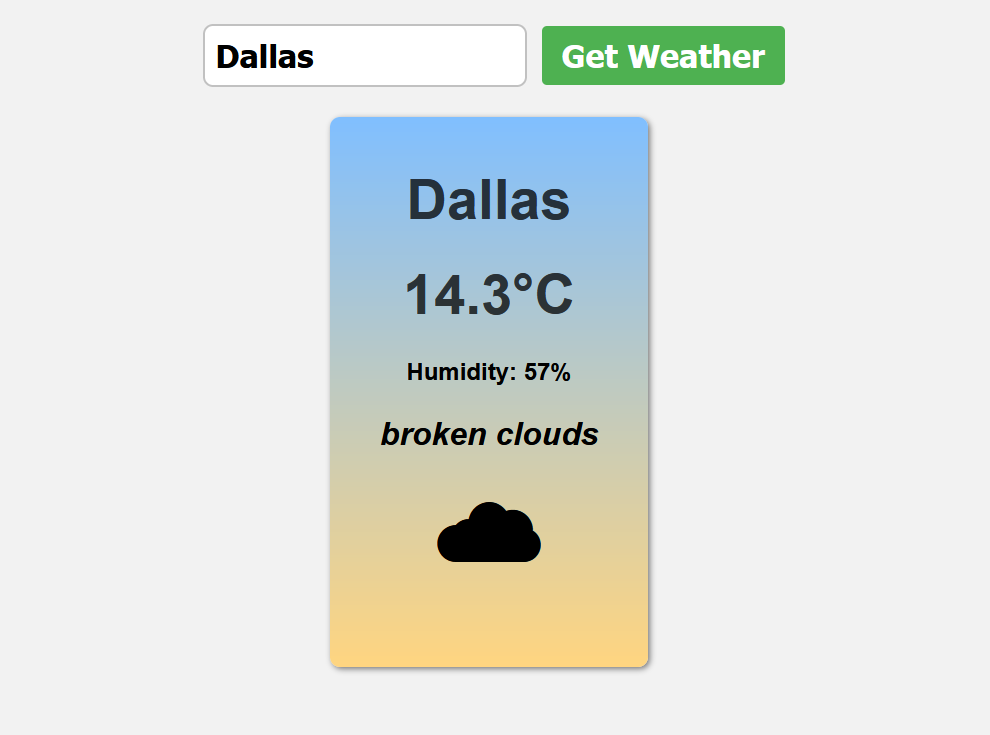

#     javascript-weather



> Este projeto recupera os dados do clima atual de qualquer cidade americana e exibe com detalhes na tela.
> 
> API utilizada é a https://openweathermap.org
> 
> Aplicativo desenvolvido com o intuito de refazer funcionalidades basicas de javascript e utilizar a função async e fetch para recuperar dados de uma API, utilizando um método deconstrutor para separar os dados recebidos no JSON.


```

## ☕ Usando

Para usar o javascript-weather, siga estas etapas:

- Utilize o live-server ou o navegador de sua preferencia para ter acesso ao index.html
- Digite uma cidade ou estado americano válido para recuperar os dados da API (Dallas, New York, Austin,Chicago ...).
